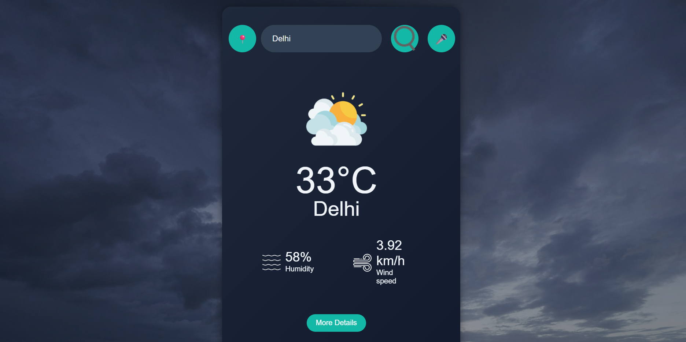

# Accessible Weather App

A voice-enabled, accessible weather web app built with HTML, CSS, and JavaScript. It fetches real-time weather data using the OpenWeatherMap API and offers dynamic backgrounds, speech input, and text-to-speech output.

---

## Features

-  Real-time weather for any city using OpenWeatherMap
-  Voice input for hands-free city search
-  Voice output (text-to-speech) reads weather details aloud
-  Accessible UI: semantic HTML, screen reader support, keyboard navigation
-  Weather-based background image updates
-  Responsive and clean layout using custom CSS

---

##  Technologies Used

- HTML5, CSS3, JavaScript (Vanilla)
- Web Speech API (for voice input/output)
- OpenWeatherMap API

---

##  Demo

## Contact

Made by [Diya Sajwan](https://github.com/di-a11y)  
Feel free to fork, star, or reach out!
