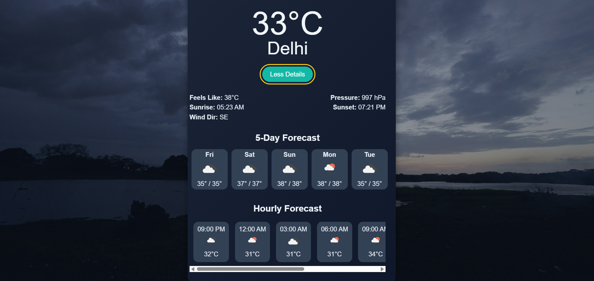
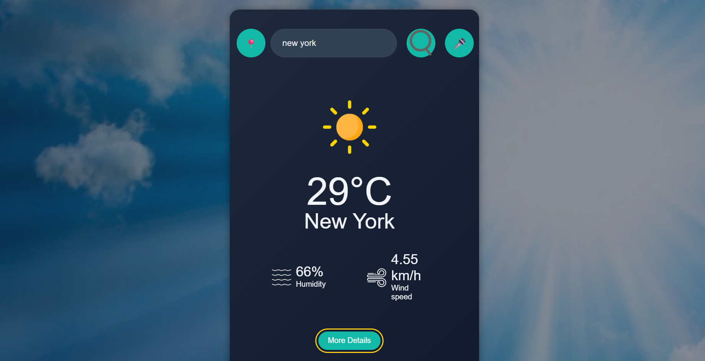

# Accessible Weather App

A voice-enabled, accessible weather web app built with HTML, CSS, and JavaScript. It provides real-time weather updates, detailed hourly and 5-day forecasts, weather alerts, and supports both typed and spoken city searches.

---

## Features

-  Real-time weather data for any city (via OpenWeatherMap API)
-  Voice input (Speech Recognition API)
-  Text-to-speech weather output (Speech Synthesis API)
-  Geolocation-based weather
-  5-day forecast (horizontally scrollable)
-  Hourly forecast (next 6–8 hours)
-  Weather alerts (storms, extreme heat, etc.)
-  Weather-based dynamic background
-  Fully accessible: screen reader support, keyboard navigation, semantic HTML
-  Mobile-responsive layout with scrollable forecast cards

---

##  Technologies Used

- HTML5, CSS3, JavaScript (Vanilla)
- Web APIs:
  - Web Speech API (voice input & output)
  - Geolocation API
- OpenWeatherMap API:
  - `/weather` (current weather)
  - `/forecast` (5-day forecast)
  - `/onecall` (weather alerts)

---

##  Demo

## Contact

Made by [Diya Sajwan](https://github.com/di-a11y)  
Feel free to fork, star, or reach out!
